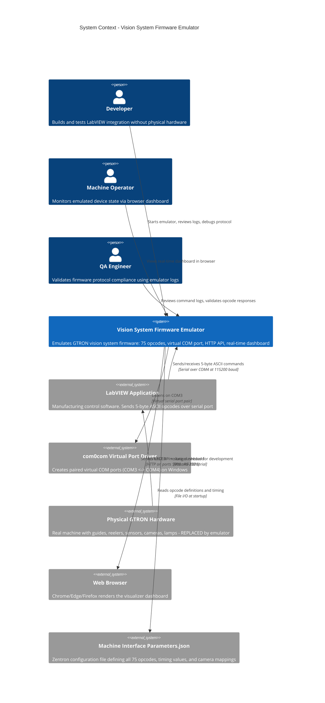

# C4 Level 1: System Context Diagram

## Vision System Firmware Emulator - Who Uses It and What It Connects To

> **Purpose**: Shows the entire system as a single box, surrounded by the people and external systems that interact with it.

---

## Context Diagram



---

## Key Relationships

| From | To | Protocol | Purpose |
|------|----|----------|---------|
| LabVIEW | Emulator | Serial (COM4 -> COM3) | Send opcodes, receive responses |
| Emulator | com0com | Virtual COM port | Provides serial endpoint |
| Emulator | Browser | HTTP REST (port 5000) | Serves device state as JSON |
| Emulator | Browser | HTTP Static (port 8000) | Serves visualizer HTML/JS/CSS |
| Emulator | File System | File I/O | Reads config, writes logs |
| Developer | Emulator | CLI + Logs | Starts process, monitors output |
| Operator | Browser | HTTP | Views real-time dashboard |

---

## What This System Replaces

```
BEFORE (Physical Setup):                    AFTER (Emulated Setup):
┌──────────┐  RS-232  ┌──────────────┐     ┌──────────┐  Virtual  ┌──────────────┐
│ LabVIEW  │────────>│ GTRON HW     │     │ LabVIEW  │────────>│ Firmware     │
│          │<────────│ (Physical)   │     │          │<────────│ Emulator     │
└──────────┘         │ - 3 Cameras  │     └──────────┘  COM    │ (Python)     │
                     │ - 2 Guides   │                   Port   │ + REST API   │
                     │ - 2 Reelers  │                          │ + Dashboard  │
                     │ - 4 Sag Sens │                          │ + Logs       │
                     │ - Tower Lamp │                          └──────────────┘
                     │ - Encoders   │
                     └──────────────┘
```

---

## Benefits of Emulation

- **No physical hardware required** - develop and test anywhere
- **Deterministic behavior** - same command sequence = same state
- **Full visibility** - every command logged with before/after state
- **Real-time monitoring** - browser dashboard shows live device state
- **Fast iteration** - no hardware setup/teardown between tests

---

*C4 Level 1 - System Context | Vision System Firmware Emulator | Zentron Projects*
