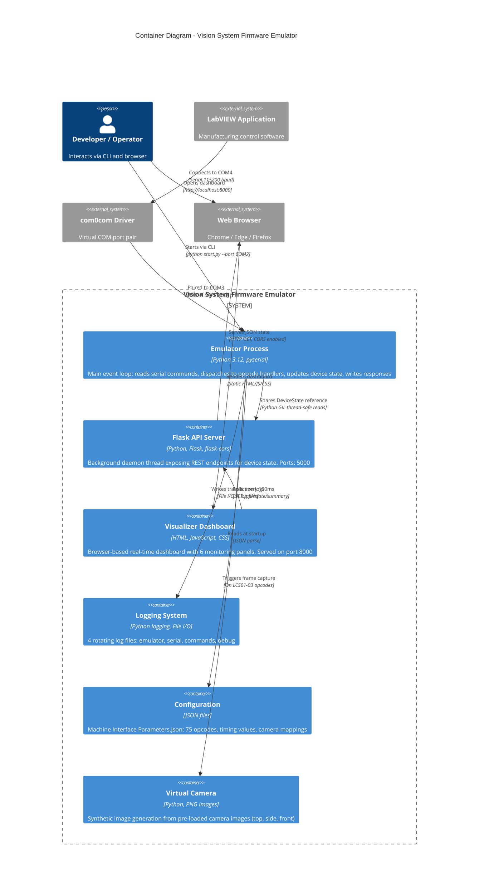

# C4 Level 2: Container Diagram

## Vision System Firmware Emulator - Major Runtime Containers

> **Purpose**: Shows the high-level technology choices and how each deployable unit communicates with the others.

---

## Container Diagram



---

## Container Details

### Emulator Process (Main Thread)

```
┌─────────────────────────────────────────────────────────┐
│  Python Process - Main Thread (Event Loop)              │
│                                                         │
│  while running:                                         │
│    cmd_bytes = serial_bridge.read(5 bytes, timeout=1s)  │
│    if cmd_bytes:                                        │
│      opcode = command_parser.parse(cmd_bytes)           │
│      response = opcode_dispatcher.dispatch(opcode)      │
│      serial_bridge.write(response)                      │
│      logger.log_transaction(opcode, response, state)    │
│                                                         │
│  Technology: Python 3.12, pyserial                      │
│  Port: COM3 (via com0com)                               │
│  Baud: 115200 (configurable)                            │
└─────────────────────────────────────────────────────────┘
```

### Flask API Server (Daemon Thread)

```
┌─────────────────────────────────────────────────────────┐
│  Background Daemon Thread - Flask WSGI                  │
│                                                         │
│  Endpoints:                                             │
│  ├─ GET /health         → {status: "ok"}    (<5ms)     │
│  ├─ GET /api/state      → Full JSON state   (<100ms)   │
│  └─ GET /api/state/summary → Compact JSON   (<20ms)    │
│                                                         │
│  Features:                                              │
│  • CORS enabled (Access-Control-Allow-Origin: *)        │
│  • Thread-safe reads from shared DeviceState            │
│  • Non-blocking to serial event loop                    │
│  • Error handling → HTTP 500 + JSON error               │
│                                                         │
│  Technology: Flask 3.1, flask-cors 6.0                  │
│  Port: 5000 (configurable via --api-port)               │
└─────────────────────────────────────────────────────────┘
```

### Visualizer Dashboard (Browser)

```
┌─────────────────────────────────────────────────────────┐
│  Static Web Application (served via HTTP port 8000)     │
│                                                         │
│  Files:                                                 │
│  ├─ index.html    (265 lines) - Dashboard layout        │
│  ├─ app.js        (300 lines) - Polling + state logic   │
│  ├─ styles.css    (17 KB)     - Dark theme styling      │
│  └─ mock_states.json          - Synthetic test data     │
│                                                         │
│  6 Monitoring Panels:                                   │
│  ├─ Guide Motors   - Position bars, open/closed status  │
│  ├─ Reeler Motors  - Speed gauges (RPM)                 │
│  ├─ Sag Sensors    - Color-coded (green=OK, red=alert)  │
│  ├─ Tower Lamp     - RGB color display                  │
│  ├─ Cameras        - Flag indicators (7 cameras)        │
│  └─ System Status  - Door, E-stop, power, last command  │
│                                                         │
│  Modes: MOCK (offline synthetic) | LIVE (API polling)   │
│  Polling: 100ms interval with auto-reconnect            │
└─────────────────────────────────────────────────────────┘
```

---

## Communication Protocols

| Path | Protocol | Payload | Frequency |
|------|----------|---------|-----------|
| LabVIEW -> Emulator | Serial (COM port) | 5-byte ASCII commands | On-demand |
| Emulator -> LabVIEW | Serial (COM port) | 3-5 byte ASCII responses | Per command |
| Visualizer -> API | HTTP GET | JSON (~150 bytes summary) | Every 100ms |
| API -> Visualizer | HTTP Response | JSON + CORS headers | Per request |
| Emulator -> Logs | File write | Structured log lines | Per command |
| Emulator -> Config | File read | JSON (~50KB) | Once at startup |

---

## Thread Model

```
┌──────────────────────────────────────────────┐
│           Single Python Process              │
│                                              │
│  Thread 1 (Main): Serial Event Loop          │
│  ├─ Blocks on serial read (1s timeout)       │
│  ├─ Processes opcodes sequentially            │
│  └─ Updates DeviceState                       │
│                                              │
│  Thread 2 (Daemon): Flask HTTP Server         │
│  ├─ Listens on port 5000                      │
│  ├─ Reads DeviceState (thread-safe via GIL)   │
│  └─ Returns JSON responses                    │
│                                              │
│  Shared: DeviceState object (read-only from   │
│  API thread, write-only from main thread)     │
└──────────────────────────────────────────────┘
```

---

*C4 Level 2 - Container Diagram | Vision System Firmware Emulator | Zentron Projects*
