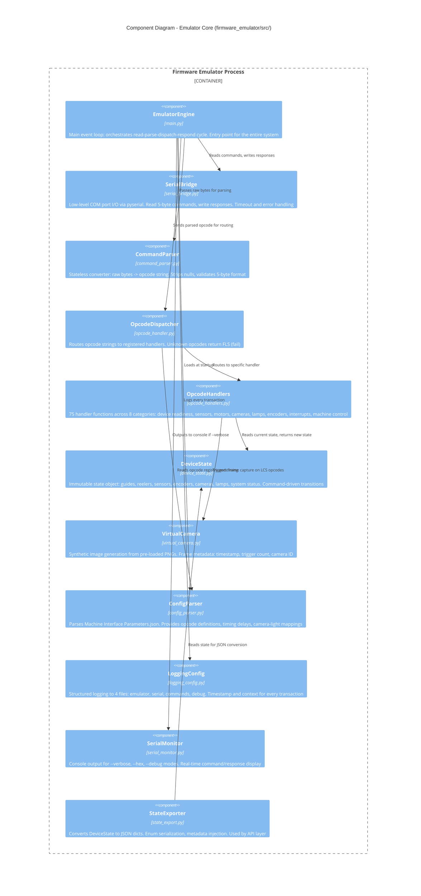

# C4 Level 3: Component Diagram - Emulator Core

## Firmware Emulator Internal Architecture

> **Purpose**: Breaks open the Emulator Process container to show its internal components and their interactions.

---

## Component Diagram



---

## Component Responsibilities

### EmulatorEngine (`main.py`)
```
Entry Point - Orchestrates the entire system

┌─────────────────────────────────────────┐
│  def run():                             │
│    config = ConfigParser.load(json)     │
│    serial = SerialBridge(COM3, 115200)  │
│    state = DeviceState()                │
│    dispatcher = OpcodeDispatcher(state) │
│    api = APIServer(StateExporter(state))│
│    api.start_daemon_thread()            │
│                                         │
│    while running:                       │
│      bytes = serial.read_command()      │
│      opcode = parser.parse(bytes)       │
│      response = dispatcher.dispatch()   │
│      serial.write_response(response)    │
│      logger.log(opcode, response)       │
└─────────────────────────────────────────┘
```

### OpcodeHandlers - 75 Commands in 8 Categories

| Category | Opcodes | Example | Response |
|----------|---------|---------|----------|
| Device Readiness | QUERY, SMINI, RSTSM | QUERY | YES |
| Guide Motors | tpGOP, tpGCL, btGOP, btGCL | tpGOP | tpGOR (2s delay) |
| Reeler Motors | tpRLR, tpRST, btRLR, btRST | tpRLR | tpROK |
| Cameras | LCS01, LCS02, LCS03 | LCS01 | LCS1 + frame |
| Tower Lamps | TLRED, TLGRN, TLBLU, TLOFF | TLRED | TLROK |
| Sag Sensors | tSSUP, tSSLO, bSSUP, bSSLO | tSSUP | sensor state |
| Encoders | tpENC, btENC, TSENB | tpENC | encoder value |
| Machine Control | DLCKD, ESTOP, PWRON | DLCKD | door state |

### DeviceState - Immutable State Machine

```
┌──────────────────────────────────────────────────┐
│  DeviceState (Immutable - new object per change) │
│                                                  │
│  Motors:                                         │
│  ├─ guide_top:    GuideState {position, moving}  │
│  ├─ guide_bottom: GuideState {position, moving}  │
│  ├─ reeler_top:   ReelerState {speed, direction} │
│  └─ reeler_bottom:ReelerState {speed, direction} │
│                                                  │
│  Sensors:                                        │
│  ├─ sag_top_upper/lower:    bool                 │
│  ├─ sag_bottom_upper/lower: bool                 │
│  ├─ encoder_top/bottom:     EncoderState         │
│  └─ sensor_top/bottom:      SensorState          │
│                                                  │
│  Output:                                         │
│  ├─ lamps: LampState {red, yellow, green, buzz}  │
│  └─ cameras: CameraState {flags[0-6], sequence}  │
│                                                  │
│  System:                                         │
│  ├─ door_locked, estop_pressed, power_on: bool   │
│  ├─ last_command: str                            │
│  └─ last_command_time: float (epoch)             │
│                                                  │
│  Design Pattern: Command -> new state object     │
│  Thread Safety: GIL protects dict reads          │
└──────────────────────────────────────────────────┘
```

---

## File Map

```
firmware_emulator/src/
├── main.py              → EmulatorEngine (entry point, event loop)
├── serial_bridge.py     → SerialBridge (COM port I/O)
├── command_parser.py    → CommandParser (bytes -> opcode string)
├── opcode_handler.py    → OpcodeDispatcher (routing registry)
├── opcode_handlers.py   → 75 opcode handler functions
├── device_state.py      → DeviceState (immutable state machine)
├── virtual_camera.py    → VirtualCamera (image generation)
├── config_parser.py     → ConfigParser (JSON config loader)
├── logging_config.py    → LoggingConfig (4 log files setup)
├── serial_monitor.py    → SerialMonitor (--verbose console)
├── state_export.py      → StateExporter (state -> JSON)
├── api_server.py        → APIServer (Flask REST, see diagram 04)
└── debug_breakpoint.py  → DebugBreakpoint (--debug mode)
```

---

*C4 Level 3 - Emulator Components | Vision System Firmware Emulator | Zentron Projects*
