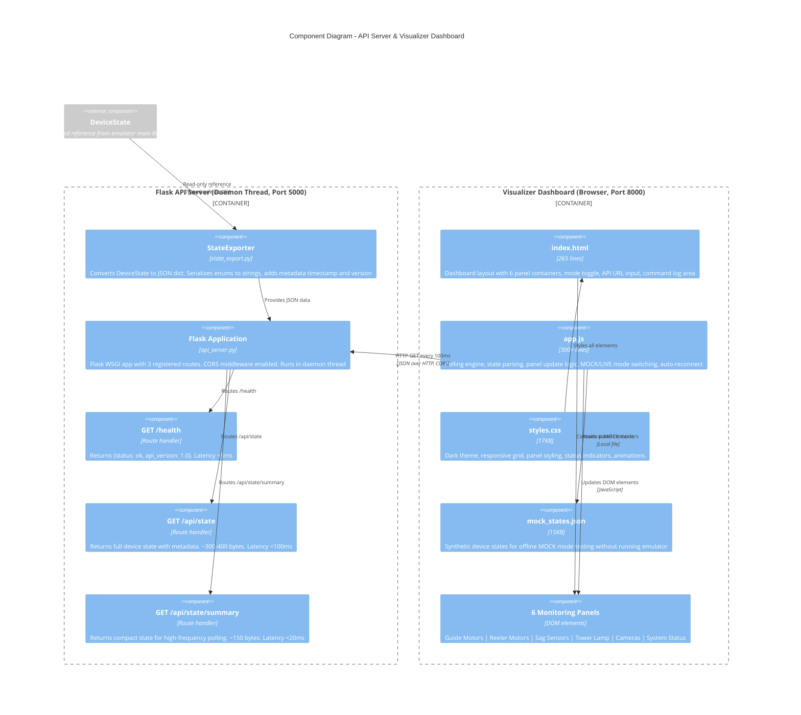
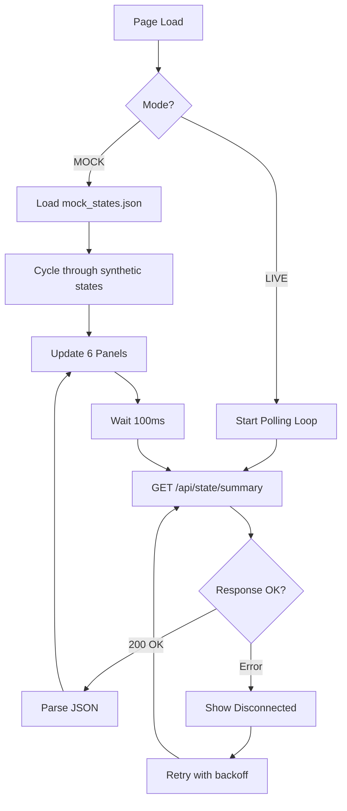

# C4 Level 3: Component Diagram - API & Visualizer

## HTTP API Layer and Browser Dashboard Architecture

> **Purpose**: Shows how device state flows from the emulator core through the REST API to the browser-based visualization dashboard.

---

## Component Diagram



---

## API Server Internals

### StateExporter - State to JSON Bridge

```
DeviceState (Python)              JSON Output
┌──────────────────┐    export    ┌────────────────────────┐
│ guide_top:       │───────────>│ "guide_top": "open"     │
│  GuidePosition   │             │ "guide_bottom":"closed" │
│  .OPEN (enum)    │             │ "reeler_top_speed": 500 │
│                  │             │ "sag_top_upper": false  │
│ reeler_top:      │             │ "lamps": {"red": false} │
│  ReelerState     │             │ "camera_flags": {...}   │
│  .speed = 500    │             │ "door_locked": true     │
│                  │             │ "last_command":"QUERY"  │
│ lamps:           │             │ "_metadata": {          │
│  LampState       │             │   "timestamp": 17...,  │
│  .red = False    │             │   "version": "1.0"     │
└──────────────────┘             │ }                       │
                                 └────────────────────────┘
```

### REST Endpoints

| Endpoint | Method | Response Size | Latency | Use Case |
|----------|--------|--------------|---------|----------|
| `/health` | GET | ~40 bytes | <5ms | Connection check |
| `/api/state` | GET | ~300-400 bytes | <100ms | Full state inspection |
| `/api/state/summary` | GET | ~150 bytes | <20ms | Dashboard polling (10Hz) |

---

## Visualizer Dashboard Panels

```
┌─────────────────────────────────────────────────────────────┐
│  VISION SYSTEM EMULATOR DASHBOARD          [MOCK] [LIVE]   │
│  API: http://localhost:5000  [Connected]                    │
├──────────────────────┬──────────────────────────────────────┤
│  GUIDE MOTORS        │  REELER MOTORS                      │
│  Top:  ████████ OPEN │  Top:  ▓▓▓▓░░░░ 500 RPM            │
│  Bot:  ░░░░░░ CLOSED │  Bot:  ▓░░░░░░░  50 RPM            │
├──────────────────────┼──────────────────────────────────────┤
│  SAG SENSORS         │  TOWER LAMP                         │
│  Top Upper:  🟢 OK   │  ┌────┐                             │
│  Top Lower:  🔴 ALERT│  │ 🔴 │ Red: OFF                    │
│  Bot Upper:  🟢 OK   │  │ 🟡 │ Yellow: OFF                 │
│  Bot Lower:  🟢 OK   │  │ 🟢 │ Green: ON                   │
│                      │  └────┘ Buzzer: OFF                  │
├──────────────────────┼──────────────────────────────────────┤
│  CAMERAS             │  SYSTEM STATUS                      │
│  Top:   ● Active     │  Door:    LOCKED                    │
│  Side:  ○ Idle       │  E-Stop:  OFF                       │
│  Front: ○ Idle       │  Power:   ON                        │
│  BotL:  ○ Idle       │  Last:    QUERY                     │
│  BotC:  ○ Idle       │  Time:    07:53:25                  │
│  BotR:  ○ Idle       │                                     │
├──────────────────────┴──────────────────────────────────────┤
│  COMMAND LOG                                                │
│  [07:53:25] QUERY → YES                                    │
│  [07:53:26] tpGOP → tpGOR (2000ms delay)                   │
│  [07:53:28] LCS01 → CAMERA TRIGGER                         │
└─────────────────────────────────────────────────────────────┘
```

---

## Polling Architecture (app.js)



---

## MOCK vs LIVE Mode

| Feature | MOCK Mode | LIVE Mode |
|---------|-----------|-----------|
| Data Source | `mock_states.json` (local) | `/api/state/summary` (HTTP) |
| Requires Emulator | No | Yes |
| Update Rate | Synthetic cycling | 100ms polling |
| Use Case | UI development, demos | Real-time monitoring |
| Connection Status | Always "Connected" | Auto-detect, reconnect |
| State Changes | Pre-defined sequence | Driven by LabVIEW commands |

---

*C4 Level 3 - API & Visualizer | Vision System Firmware Emulator | Zentron Projects*
