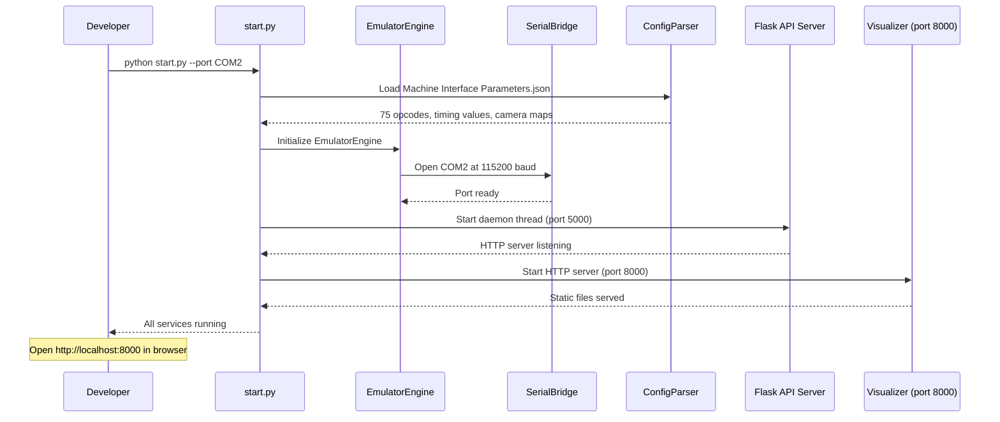
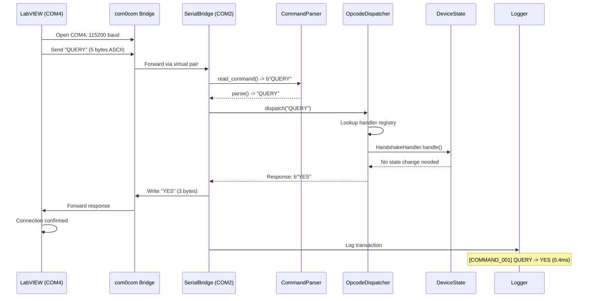
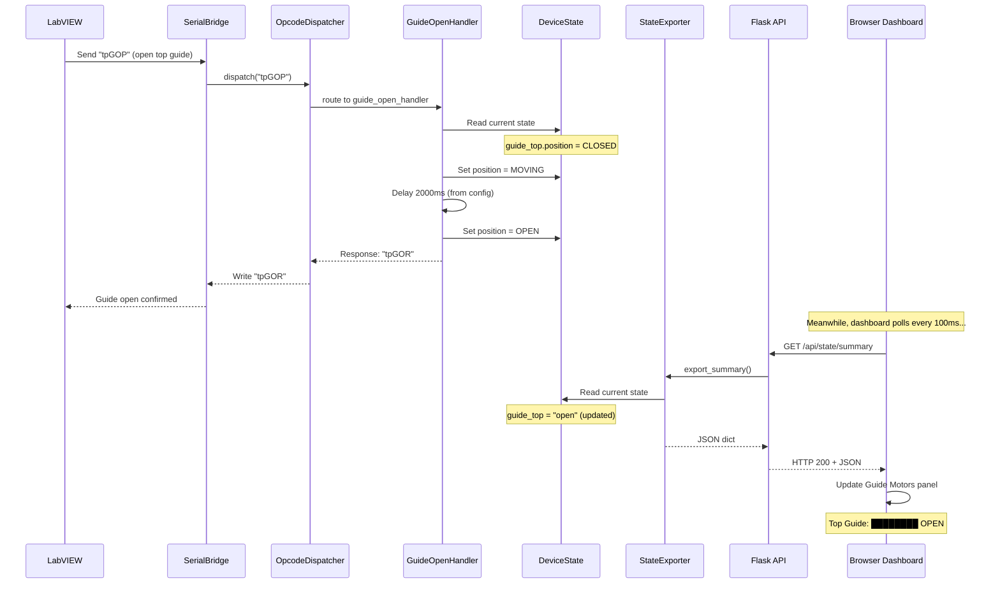

# C4 Sequence Diagram: End-to-End Command Flow

## From Startup to Real-Time Visualization

> **Purpose**: Shows the complete lifecycle - system startup, LabVIEW handshake, command processing, state updates, and visualization polling as a time-sequenced flow.

---

## Phase 1: System Startup



---

## Phase 2: LabVIEW Handshake



---

## Phase 3: Command Processing (Guide Open Example)



---

## Phase 4: Continuous Operation

```
Timeline: Concurrent Serial + HTTP Operations
════════════════════════════════════════════════════════════════════

Time     Main Thread (Serial)              Daemon Thread (HTTP API)
──────   ──────────────────────            ─────────────────────────
  0ms    read_command() [blocking]         [idle - waiting]
 50ms    ...waiting for serial data...     GET /api/state/summary
 51ms    ...                               → export_summary()
 52ms    ...                               → HTTP 200 + JSON
100ms    Received: "tpGOP"                 [idle]
101ms    parse("tpGOP")                    [idle]
102ms    dispatch → GuideOpenHandler       [idle]
103ms    Set state: MOVING                 [idle]
150ms    ...delay 2000ms...               GET /api/state/summary
151ms    ...                               → state shows "moving"
152ms    ...                               → HTTP 200 + JSON
250ms    ...delay continues...             GET /api/state/summary
251ms    ...                               → state still "moving"
 ...     ... (2 second delay) ...          ... (20 more polls) ...
2102ms   Set state: OPEN                   [idle]
2103ms   Write response: "tpGOR"           [idle]
2104ms   Log transaction                   [idle]
2150ms   read_command() [blocking]         GET /api/state/summary
2151ms   ...waiting...                     → state shows "open"
2152ms   ...                               → HTTP 200 + JSON

Key: Both threads access DeviceState safely (Python GIL)
     API thread NEVER blocks the serial event loop
     Dashboard sees state transitions in real-time (100ms granularity)

════════════════════════════════════════════════════════════════════
```

---

## Complete Data Flow Summary

```
┌──────────┐  5-byte   ┌───────────┐  parse   ┌──────────┐  route   ┌──────────┐
│ LabVIEW  │──ASCII──>│  Serial   │────────>│ Command  │───────>│ Opcode   │
│ (COM4)   │          │  Bridge   │          │ Parser   │        │Dispatcher│
└──────────┘          │  (COM2)   │          └──────────┘        └────┬─────┘
     ▲                └─────┬─────┘                                   │
     │                      │                                    handle│
     │                      │                                         ▼
     │               write  │                               ┌──────────────┐
     │              response│                               │   Handler    │
     │                      │                               │  (1 of 75)   │
     │                      │                               └──────┬───────┘
     │                      │                                      │
     │                ┌─────▼─────┐                          update │
     │                │  Serial   │                                │
     └───3-5 byte────│  Bridge   │                          ┌─────▼──────┐
        response      └───────────┘                          │  Device    │
                                                             │  State     │
                      ┌───────────┐   read    ┌──────────┐  │ (immutable)│
                      │  Browser  │◄──JSON───│  Flask    │◄─┤            │
                      │ Dashboard │  (HTTP)  │  API      │  └────────────┘
                      │ (6 panels)│  100ms   │ (port     │
                      └───────────┘  poll    │  5000)    │
                                              └──────────┘

                      ┌───────────┐
                      │   Logs    │◄── Every transaction logged
                      │ (4 files) │    with before/after state
                      └───────────┘
```

---

## Startup Command Reference

```bash
# Full stack (recommended)
python start.py --port COM2

# Individual components
python firmware_emulator/src/main.py --port COM2 --verbose   # Emulator only
python -m http.server 8000 --directory visualizer             # Dashboard only

# With options
python start.py --port COM2 --api-port 8080 --verbose --rtscts
```

---

*C4 Sequence Diagram - Command Flow | Vision System Firmware Emulator | Zentron Projects*
